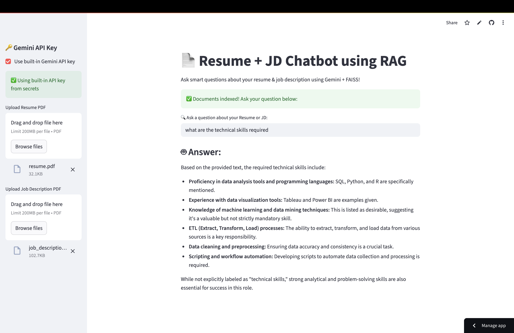

## 📄 Resume + Job Description Matching Chatbot using RAG

This project uses **Retrieval-Augmented Generation (RAG)** with FAISS and Gemini to match resumes against job descriptions. The chatbot allows users to upload a resume and JD (both in PDF), ask smart questions, and get AI-powered feedback on relevance, strengths, and gaps.

Deployed using **Streamlit**, the app offers an intuitive interface for recruiters and job seekers alike.

---

## 🔍 Project Overview

In today’s hiring landscape, evaluating resumes against job descriptions is time-consuming. This tool uses **generative AI + document retrieval** to analyze both documents and give intelligent, human-like insights.

The system breaks documents into chunks, embeds them using `sentence-transformers`, indexes them with **FAISS**, and then uses **Gemini LLM** to answer queries in real time.

---

## 💡 Key Idea:

Combine **semantic search** (FAISS + sentence embeddings) with **generative reasoning** (Gemini API) to provide an explainable and interactive experience for recruiters or applicants.

---

## 📁 Project Structure

```
rag-chatbot/
├── app.py                      # Streamlit UI
├── build.py                    # Builds FAISS index
├── embed.py                    # Embedding + chunking functions
├── rag_chat.py                 # RAG pipeline with Gemini
├── requirements.txt            # Python dependencies
├── .streamlit/
│   └── secrets.toml            # For storing Gemini API key (locally or on Streamlit Cloud)
├── data/                       # PDF samples (resume + JD)
├── faiss_index/                # Saved index + chunks
├── README.md                   # Project documentation
├── screenshots/
│   └── app.png                 # UI screenshot
```

---

## 📊 Input Description

* **Resume** (PDF)
* **Job Description** (PDF)

🔄 Both are chunked and embedded. The user can then type questions like:

* *“What are the missing skills in this resume?”*
* *“How well does the resume match this job?”*

---

## 🎯 Goals

* 🧠 Embed & retrieve relevant text chunks from both documents
* 💬 Use Gemini to generate natural-language answers
* 📂 Handle resume + JD parsing from PDF
* 🌐 Make it usable via Streamlit UI
* 🔐 Secure API key with `st.secrets`

---

## ⚙️ Setup Instructions

### 1. Clone the repository

```bash
git clone https://github.com/your-username/rag-chatbot.git
cd rag-chatbot
```

### 2. Create a virtual environment

```bash
python3 -m venv venv
source venv/bin/activate
```

### 3. Install dependencies

```bash
pip install -r requirements.txt
```

### 4. Add your Gemini API key

Create a file `.streamlit/secrets.toml` and paste:

```toml
GEMINI_API_KEY = "AIzaYourGeminiKeyHere"
```

### 5. Run the app

```bash
streamlit run app.py
```

---

## 🧠 RAG Pipeline Used

| Component             | Description                                            |
| --------------------- | ------------------------------------------------------ |
| FAISS                 | Vector store to store embedded chunks from PDF         |
| sentence-transformers | Embeds resume and JD chunks using MiniLM model         |
| Gemini LLM            | Used for final natural-language reasoning and response |
| Streamlit             | Web UI for user interaction                            |

---

## 📈 Features

✅ Real-time Q\&A over your resume + JD
✅ Gemini-powered smart answers
✅ File upload + PDF parsing
✅ Highlights skills gap and alignment
✅ Can be deployed publicly (Streamlit Cloud)

---

## 🖼️ App Preview

| Upload & Question                      | Gemini Sample Response                                                                                          |
| -------------------------------------- | -------------------------------------------------------------------------------------------------------- |
|  | *“You are missing key requirements like SQL and DevOps. However, your ML experience is a strong match…”* |

---

## 📝 Output Example

> **Score:** 78
> **Explanation:**
>
> * Strong match on ML, Python, team projects
> * Missing some cloud skills
>
> **Result:** Under Review

---

## 🚀 Future Enhancements

✅ Add PDF report generation
✅ Add score breakdown + visualization
✅ Support for multiple resumes or jobs
🔍 Add LLM comparison (Gemini vs Claude)
📁 Export answers to .txt/.csv

---

## 🙌 Acknowledgments

* [Gemini API by Google](https://makersuite.google.com/)
* [FAISS by Facebook AI](https://github.com/facebookresearch/faiss)
* [sentence-transformers](https://www.sbert.net/)
* Streamlit Community
* Special thanks to OpenAI’s RAG docs for inspiration

---

## 🌐 Live Demo

👉 **[Use the Deployed Chatbot on Streamlit](https://rag-chatbot-srishti.streamlit.app/)**


